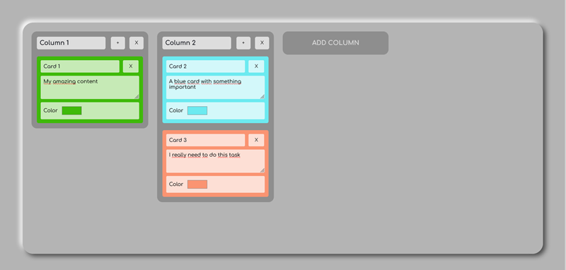

# Trello App

A simple and clean Kanban board inspired by Trello, built with Vue 3 and TypeScript.  
This project was developed as part of a school assignment focused on creating a functional Trello-style app using modern front-end tools and architecture.



---

## 🚀 Demo

See my [portfolio yohannimation](https://yohannimation.fr)

---

## 🧰 Tech Stack

- ⚙️ **Vue.js 3** – Front-end framework
- ⚡ **Vite** – Fast build tool
- 🧠 **Pinia** – State management
- 🟦 **TypeScript** – Type safety
- 🎨 **Sass** – Styling
- 🧩 **Atomic Design** – Component structure

---

## 🎯 Project Goal

The goal of this project was to implement a Trello-like Kanban board using Vue 3 and TypeScript.  
The application allows users to create and manage columns and cards in a visual and interactive way.

---

## ✨ Features

- ✅ Create, rename, and delete **columns**
- ✅ Create, edit (title, content, color), and delete **cards**
- ✅ Drag and drop cards between columns
- ✅ Color customization for each card
- 🎉 Fun confetti animation on card deletion

---

## 📦 Installation

```bash
# Clone the repository
git clone https://github.com/yohannimation/trello-app.git

# Go to the project directory
cd trello-app

# Install dependencies
npm install

# Run the app locally
npm run dev
